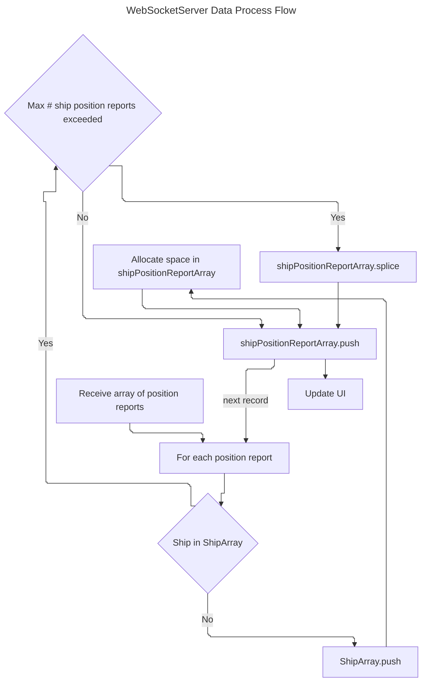

```mermaid
---
title: WebSocketServer Data Process Flow
---

%%{ init: { 'flowchart': { 'curve': 'stepAfter' } } }%% 

    flowchart-elk TD;
        A[Receive array of position reports] --> B[For each position report];
        B --> C{Ship in ShipArray};
        C -- No --> D[ShipArray.push];
        D --> E[Allocate space in shipPositionReportArray]
        C -- Yes --> F{Max # ship position reports exceeded}
        F -- Yes --> G[shipPositionReportArray.splice]
        F -- No --> H[shipPositionReportArray.push]
        G --> H
        E --> H
        H -- next record --> B
        H --> I[Update UI]
        
```
